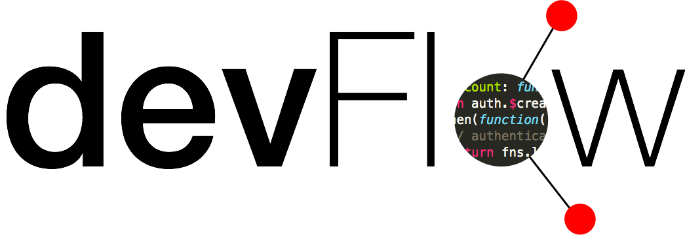

</img><br>

DevFlow
==============

## What is DevFlow?
Deflow is a network for developers and designers to share how they work. You can build the site with the instructions below or visit the website live [here](https://devflow.firebaseapp.com). Built at CodeDay Chicago Fall 2014.

## Building DevFlow
```sh
$ npm install
$ bower install
$ grunt serve
```

## Deploying to Firebase
```sh
$ npm install -g firebase-tools
$ firebase login
$ grunt build
$ firebase deploy
```

## License
[MIT License](LICENSE)
